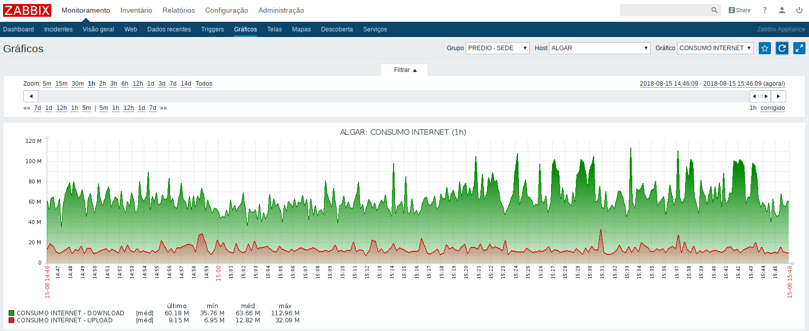
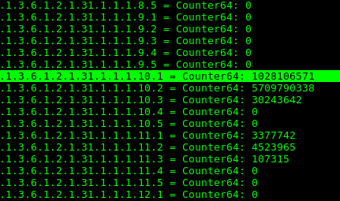
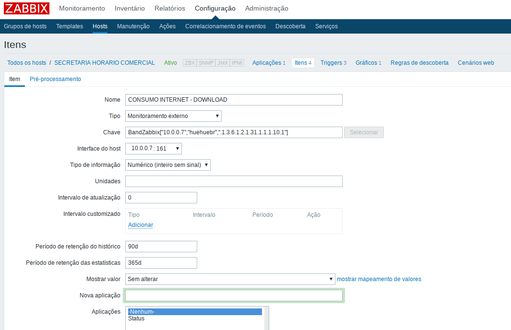

## BandZabbix - Graphics Easily using External Script.  

This is a external colector script created to improve Zabbix, if you dont wanna wast your time with a lot of bored configurations.

<b>Be happy easly dude ...</b>

<b> 1º step - Downloading BandZabbix</b>

<pre><code># cd /usr/lib/zabbix/externalscripts
# curl -O https://raw.githubusercontent.com/juliolix/BandZabbix/master/BandZabbix
# chown zabbix.zabbix BandZabbix
# chmod 755 BandZabbix
</code></pre>

<b> 2º step - Install snmpwalk </b>

<pre><code># cd /usr/lib/zabbix/externalscripts
# apt-get install snmp 
# vim /etc/zabbix/zabbix_server.conf 
change 
          # Timeout=30
to 
            Timeout=30
</code></pre>

<b> 3º step - lets testing the BandZabbix  </b>

<pre><code># ./BandZabbix 10.0.0.7(ip) huehuebr(community) .1.3.6.1.2.1.31.1.1.1.10.1(OID)
</code></pre>

If you note that's OID above. its is a interface "ether0" Mikrotik, however OIDS change ever. You will need be patience to <b>find out</b> correct OID to its interface. I'm gonna show you how to.

<pre><code>#  snmpwalk -v 2c -c huehuebr -On 10.0.0.7 
</pre></code>
 
.1.3.6.1.2.1.31.1.1.1.10.1 = eth0 interface download 

<b> Final Step - Configuring Zabbix </b>

- Create host 
- Create Item 

 
 
 

<b> Result: Status = Enabled</b> 

 
 
 

<b><i> source code: </i></b>

<pre><code>
#!/bin/bash
#Script gerador de dados para Zabbix
#Criado por: Julio Martins Prefeitura de JF 
#juliolix@gmail.com
#Lembre de Instalar o snmpwalk no servidor Zabbix
#apt-get install net-snmp snmp-utils
#descomentar em /etc/snmp/snmp.conf
#mibs :

#STRING='.1.3.6.1.2.1.2.2.1.10.2'
#VARIAVEL PARA OIDs Especiais
STRING=$3

#CMN='hakiluffy'
#VARIAVEL PARA COMMUNITY
CMN=$2

#IP='168.82.180.24'
#VARIAVEL PARA IP MONITORADO
IP=$1

TEMPO='5'

ANTERIOR=$(snmpwalk -v 2c -c $CMN -On $IP $STRING | awk '{print $4}')

sleep $TEMPO

ATUAL=$(snmpwalk -v 2c -c $CMN -On $IP $STRING | awk '{print $4}')

TOTAL=$(($ATUAL-ANTERIOR))

BYTES=$(($TOTAL/$TEMPO))
BITS=$(($BYTES*8))
VELOCIDADE=$(($BITS/1024*1000))

#echo $ANTERIOR
#echo $ATUAL

echo $VELOCIDADE
